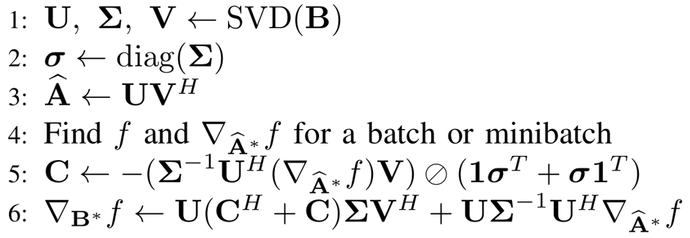

# Orthogonal RNN using inline orthogonalization
Code for a cancelled project/paper. Written in theano during Spring 2017. 
Here, instead of minimizing f(A) where AA^T=I, we minimize f((BB^T)^-1/2 B). Let 
A_hat = (BB^T)^-1/2 B, we can see that A_hat is always orthogonal if B is full-row rank.
Gradient w.r.t B is

